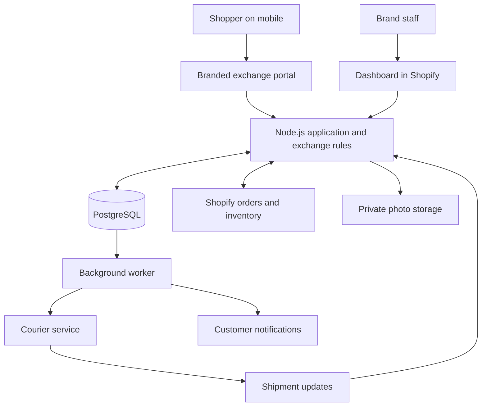
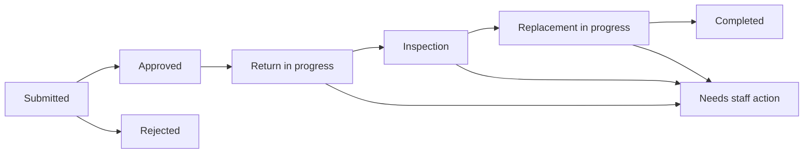

# Fashion exchange SaaS — stack and project plan

**Date:** 3 October 2026  
**Product decision:** Exchanges for Egyptian fashion brands.  
**Build approach:** Founder and assistant build together.  
**Cash budget:** Up to 10,000 EGP over the first three months, excluding founder time.  
**Proposed first platform:** Shopify. Confirm it with the first committed merchant.  
**Proposed first courier:** Bosta, subject to merchant account access and service conditions.

## 1. The product in one sentence

A branded portal where a shopper requests a clothing exchange, connected to a dashboard where the brand approves it, manages collection and replacement, and resolves problems.

The brand is our paying customer. Its shoppers use the portal. The first measurable promise is less staff work and fewer failed size exchanges.

This document is the current implementation plan. The earlier competitor report and launch plan provide background; the current build scope is the exchange product.

## 2. Stack decisions

Use one application repository and one Node.js web application, with a background worker running code from the same repository. React Router handles the pages and server endpoints. Domain services contain the exchange rules so they are reusable across the portal, dashboard, and integrations.

| Layer | Choice | Plain-language purpose |
|---|---|---|
| Runtime | Node.js 24 LTS | Runs the application on the server |
| Language | TypeScript | Adds checks to JavaScript so mistakes are easier to catch |
| Application framework | React Router in framework mode, following the Shopify app template | Builds pages, handles form submissions, and supplies the Node server application structure |
| Customer interface | React + Tailwind CSS | Creates the mobile exchange portal with each brand's colors |
| Merchant interface | Shopify App Bridge + Polaris web components | Presents the staff dashboard inside Shopify admin |
| Database | PostgreSQL | Stores brands, requests, items, shipments, and history |
| Database access | Prisma ORM | Defines database models, queries, and versioned schema changes |
| Input validation | Zod | Checks incoming fields before we process them |
| Background work | pg-boss | Runs durable tasks such as notifications and courier retries using PostgreSQL |
| Photo storage | Private Cloudflare R2 bucket | Stores evidence photos with controlled access |
| Transactional email | Resend | Sends verification codes and exchange status updates |
| Languages | English/Arabic dictionaries and right-to-left layout support | Makes the customer experience usable in both languages |
| Verification | Vitest + Playwright | Checks business rules and complete customer/staff flows |
| Hosting | A managed Node server and managed PostgreSQL; supplier selected before pilot | Runs the web app and worker continuously with backups and HTTPS |

Node 24 is currently an LTS line; Node recommends LTS releases for production. Shopify recommends its React Router template for most new apps. [Node release policy](https://nodejs.org/en/about/previous-releases), [Shopify libraries and templates](https://shopify.dev/docs/api/libraries-and-templates)

React Router will handle the server routes; a separate Express API is not part of this initial design. That keeps the first build in one codebase. Package versions will be pinned and checked for compatibility when scaffolding rather than using unverified versions in this plan.

References for the selected components: [Polaris and App Bridge](https://shopify.dev/docs/api/app-home/latest), [Tailwind](https://tailwindcss.com/docs/installation/using-vite), [PostgreSQL](https://www.postgresql.org/about/), [Prisma](https://www.prisma.io/docs/orm), [Zod](https://zod.dev/), [pg-boss](https://github.com/timgit/pg-boss), [R2](https://developers.cloudflare.com/r2/), [Resend](https://resend.com/docs/introduction), [Vitest](https://vitest.dev/guide/), [Playwright](https://playwright.dev/docs/intro).

## 3. How the parts communicate



The customer interface asks for an exchange. The server decides whether it is valid. The database preserves the decision and history. Background jobs perform slower external actions. The merchant dashboard and customer tracking page display the same underlying request.

Shopify remains the authority for orders, product variants, and stock. Our database is the authority for the request workflow, app permissions, policy snapshots, and event history. A cached stock count is not a guaranteed reservation.

## 4. What the first version includes

**Initial exchange scope:** one order item per request, with a quantity limited to the remaining exchangeable quantity. Size/color changes within the same product, restricted initially to variants that do not require an additional merchandise payment. One shipment origin per request.

| Capability | First demo | Live pilot |
|---|---|---|
| Brand colors, support details, exchange policy | Editable demo settings | Saved separately for each merchant |
| Order lookup | Sample orders | Verified access to Shopify orders |
| Item, reason, replacement selection | Working end-to-end | Live eligibility and stock rechecks |
| Conditional photo evidence | Demo upload | Private validated uploads |
| Shipping fee summary | Configurable sample values | Agreed merchant fee rules and recorded payment status |
| Request queue, approve/reject, tracking | Working | Authenticated staff actions and full event history |
| Return inspection and replacement dispatch | Simulated statuses | Staff actions connected to one courier |
| English, Arabic, mobile layout | Included | Included |
| Basic performance reporting | Sample/recorded requests | Measured completion, staff handling, and exceptions |

The first production workflow uses staff approval and inspection before dispatching the replacement. Courier-swap support can be added after the first merchant validates that workflow and the courier service supports it.

Product-to-product exchanges, additional merchandise payments, automated refunds, store credit, multiple couriers, extra store platforms, and WhatsApp automation belong to later releases. The first version can record a case that requires an alternative resolution and route it to staff.

## 5. A concrete example

A shopper bought a black shirt in medium for 800 EGP and wants large. Assume the brand has configured a 60 EGP exchange shipping fee; this is a demo value, not a courier quote.

1. The shopper opens the brand's portal and verifies access to the original purchase.
2. The app checks delivery eligibility, the merchant's exchange window, product exclusions, and previously exchanged quantity.
3. The shopper chooses the shirt and the reason "size too small".
4. The app shows eligible alternative variants and explains any required evidence.
5. The shopper chooses large and sees the 60 EGP shipping fee and collection method.
6. The server validates the request again and saves it with a reference number.
7. Staff approves after checking current availability and the request details.
8. Collection is arranged, the old shirt is received and inspected, then the replacement is released and shipped.
9. The tracking page updates as events arrive. Staff closes the request only after the configured completion conditions are met.

If large sells out before dispatch, staff sees an actionable exception and asks the shopper to choose an alternative. A request approval alone never proves the replacement is on its way.

## 6. Screens we will build

### Shopper portal

| Screen | What it does |
|---|---|
| Start and verify | Finds the purchase and confirms access before revealing order data |
| Choose item | Shows eligible purchased items and remaining quantities |
| Explain issue | Collects a reason, optional notes, and required evidence |
| Select replacement | Shows available eligible size/color variants |
| Review and submit | Explains the original item, replacement, fees, and next step |
| Track request | Shows history and any action required from the shopper |

### Merchant dashboard

| Screen | What it does |
|---|---|
| Overview | Shows new, active, overdue, and completed requests |
| Request list | Filters by status, reason, and date |
| Request detail | Shows purchase, photos, replacement, fees, history, and allowed actions |
| Exceptions | Gives staff an owner and next action for stock/shipping/inspection issues |
| Settings | Controls branding, exchange window, evidence, fees, and notifications |
| Basic report | Shows completed exchanges, reasons, stock failures, and handling time |

Each page should explain what the user can do next. Demo integrations and simulated statuses must be clearly labeled in the prototype.

## 7. Important business decisions and proposed defaults

| Decision | Proposed default |
|---|---|
| When requests are accepted | Delivered purchases satisfying that brand's configured policy |
| Exchange window | Configurable per merchant; no universal day count assumed |
| Approval | Staff approves each request during the pilot |
| Evidence | Merchant rules determine when photos are required |
| Workflow | Collect, inspect, then dispatch the replacement |
| Stock | Check at selection, approval, and replacement release; only claim reservation when the store integration actually supports and confirms it |
| Original price | Preserve the original paid amount and allocated discounts |
| Fees | Show an agreed calculation, currency, and payment method before submission; store a snapshot |
| Refund/alternative request | Staff-assisted resolution initially |
| Cancellation | Staff-controlled after shipping begins; record why and what inventory actions remain |
| Customer verification | Email one-time code first; phone-only orders use a merchant-assisted verified link until a phone verification provider is ready |
| Brand login | Shopify-authenticated merchant access, with checked owner/staff permissions |
| Languages | English and Arabic; remember the shopper's choice |

Shipping fee collection must be confirmed for the chosen courier workflow. If the integration cannot collect it in that workflow, the pilot needs an explicit merchant-arranged payment step. A displayed fee does not prove payment was collected.

## 8. Database explained simply

| Record | Information it preserves |
|---|---|
| Merchant | Store identity, branding, configuration, integration state |
| Staff membership | Which authenticated staff member can perform which actions |
| Policy version | Rules that applied when a shopper submitted a request |
| Order reference/snapshot | Store order and item identifiers plus the purchase values needed for the exchange |
| Exchange request | Customer access reference, reason, status, selected resolution |
| Request item | Original variant, replacement variant, and quantity |
| Shipment | Old-item collection and replacement delivery, with separate identifiers and statuses |
| Charge record | Amount due, currency, payment method, and confirmed payment state |
| Attachment | Private file reference and validated image metadata |
| Event | Who performed an action, when, and its result |
| Notification | What update was scheduled, sent, failed, or retried |
| Verification/session | Short-lived access to the correct shopper purchase or merchant account |

Merchant-owned records carry the merchant identity and every query enforces that boundary. Money is stored in integer piastres for EGP. Historical values stay attached to the request even if a product price or policy later changes.

## 9. Request and parcel statuses

Track the request, returning parcel, and replacement parcel separately. One parcel arriving does not mean both sides of the exchange have completed.



An exception preserves the preceding state and required next action. Completion means the replacement delivery and original-item handling have reached the merchant's defined end conditions. Fees must also be resolved when applicable. Cancellation does not erase history.

## 10. Integrations and rollout

The Shopify adapter reads authorized orders, products, fulfillment information, and current inventory. Later write operations must use supported exchange/return workflows and be verified on a development store so reporting and stock remain correct.

The courier adapter creates approved return pickups or replacement deliveries and records their tracking identifiers. Bosta documents return pickup and exchange services; the merchant account's capabilities and pricing still need verification. [Bosta documentation](https://docs.bosta.co/docs/how-to/create-your-first-delivery/)

Before live installation across independent brands, choose Shopify's appropriate distribution method. Public distribution is designed for many merchants and involves app review; custom distribution is limited to a single store or stores in one Plus organization. A custom install link is not a general multi-brand pilot shortcut. Request the order/customer-data access the app actually needs. [Distribution](https://shopify.dev/docs/apps/launch/distribution/select-distribution-method), [Protected customer data](https://shopify.dev/docs/apps/launch/protected-customer-data)

Developer accounts, development store, merchant access, and courier credentials are integration prerequisites. They are not needed to demonstrate a local sample-data flow. No accounts or paid subscriptions have been created as part of this planning task.

## 11. Development phases

Estimates assume regular development time and are planning ranges, not fixed delivery commitments. Integration access and platform review can add calendar time.

| Phase | Planning effort | Deliverable | Finished when |
|---|---|---|---|
| 1. Local demonstration | 5–8 development days | Portal, staff queue, sample brand/orders, saved local requests | A sample request survives reload and moves from submission to completion |
| 2. Shopify foundation | 5–8 days | Authentication, legitimate order access, eligibility, product/stock reads | Dev-store orders work; unauthorized access and invalid items are rejected |
| 3. Workflow reliability | 5–8 days | Policies, photos, fees, staff permissions, notifications, exception handling | Stock changes, repeated submissions, and failures have safe visible outcomes |
| 4. Courier connection | 5–10 days | One live-capable adapter and status processing | Test shipments and retries produce correct request/parcel records |
| 5. Controlled pilot | 1–2 weeks of observation | First merchant, bounded volume, support and measurement | Representative requests complete correctly and the merchant chooses to continue |

A broader 3-brand rollout follows only when distribution, data access, and the first merchant's workflow are ready. In parallel with building, the founder should recruit merchants and validate willingness to pay.

## 12. Verification before live use

Required meaningful checks:

- Another merchant or an unverified shopper cannot access the order, request, or photo.
- Expired/ineligible items and quantities already exchanged cannot be submitted again.
- Two simultaneous approvals cannot silently allocate the same exchangeable quantity.
- A stock change produces an exception before replacement release.
- Repeated submissions, courier callbacks, and retries cannot create duplicate requests or shipments.
- A timeout after an external action triggers a status check/manual review before another action is attempted.
- Returned stock becomes sellable only after the configured inspection outcome; refund or replacement records do not double-count revenue.
- Fees use exact arithmetic and the confirmed payment state remains separate from the calculated amount due.
- Arabic and English flows work on a phone; evidence requirements and rejection explanations are understandable.
- Saved records survive application restart; backup restoration is exercised before pilot reliance.

The durable queue alone does not guarantee that an external courier acts exactly once. We need operation identifiers, recorded results, and recovery logic around external calls.

## 13. Budget and release milestones

| Envelope for the first three months | Ceiling |
|---|---:|
| Node hosting, database, photo storage, domain, backups | 2,000 EGP |
| Verification/status messaging and necessary tests | 1,000 EGP |
| Necessary pilot expense or integration contingency | 1,000 EGP |
| Reserve | 6,000 EGP |
| **Total** | **10,000 EGP** |

These are spending caps, not provider quotes. Price actual hosting and messaging usage before activation, including applicable taxes and currency conversion. Merchant courier charges remain separate unless explicitly agreed. Reduce scope or revise the envelope if actual quotes exceed it.

Release milestones:

1. **Demo ready:** sample exchange works on both customer and staff screens.
2. **Integration ready:** legitimate store access and one courier workflow work in controlled tests.
3. **Pilot ready:** deployment, data access, permissions, records, recovery, and verification are ready for the first merchant.
4. **Paid product ready:** the merchant finds enough measured value to subscribe; platform billing and distribution are implemented for the chosen route.

Pricing and app billing configuration are a separate release task. The earlier proposed commercial prices remain hypotheses until a merchant commits and the supported billing route is confirmed.

## 14. First development backlog

Build in this order:

1. Create the Node/TypeScript/React Router foundation and a working local database.
2. Seed a fictional Egyptian clothing brand, an order, product variants, policy, and exception cases.
3. Implement the exchange service: eligibility, remaining quantity, replacement rules, fee quote, and allowed state transitions.
4. Build the customer form and confirmation/tracking page.
5. Build the staff list/detail screens and approve/reject/inspection actions.
6. Save an event for every meaningful action and refresh both views from the same records.
7. Verify one success path plus unavailable size, duplicate request, rejected inspection, and canceled request.
8. Demonstrate to prospective merchants, then wire the store and courier adapters around the agreed workflow.

### Proposed repository layout

```text
exchange-saas/
  app/
    routes/           customer pages, staff pages, server endpoints
    components/       reusable interface elements
    services/         exchange, policy, stock, fee, access rules
    integrations/     Shopify, courier, storage, email adapters
    jobs/             background task definitions and handlers
    locales/          English and Arabic text
  prisma/             database models, migrations, sample data
  tests/              business-rule and integration checks
  e2e/                browser journeys
  docs/               setup and operational notes
```

The first milestone is a usable demonstration backed by real saved local records. It gives us something concrete to show merchants while real-account access and shipping rules are arranged.
