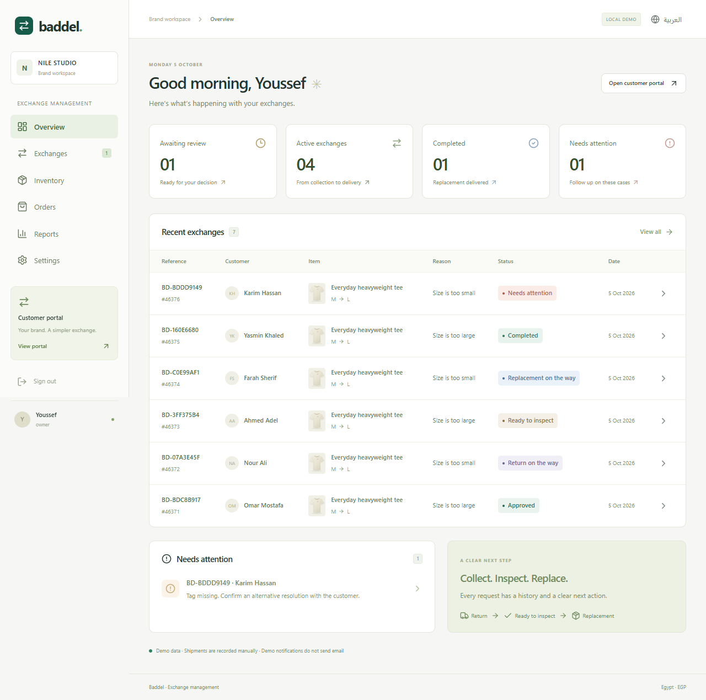
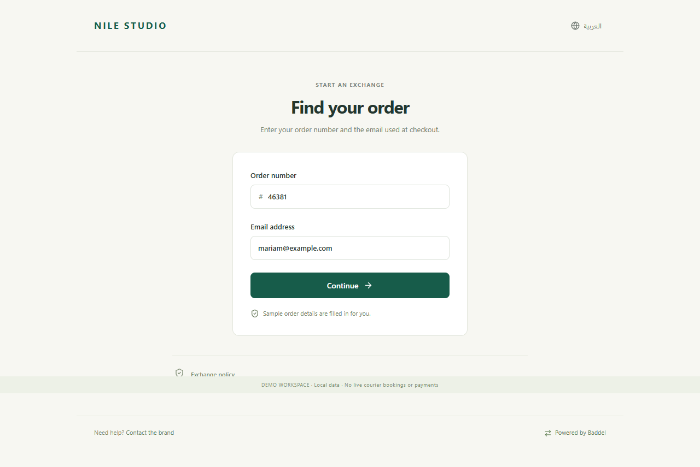
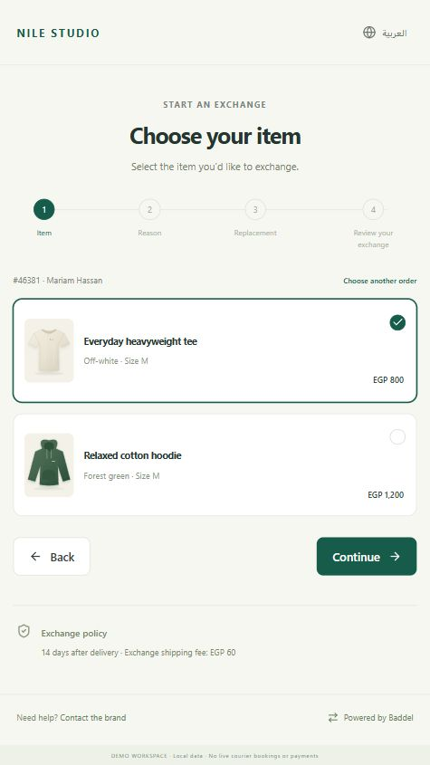
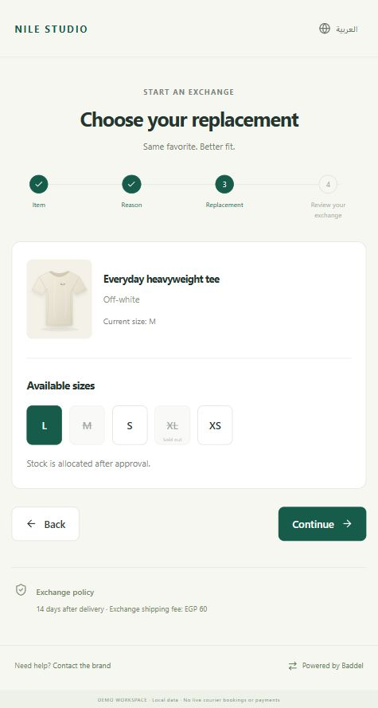
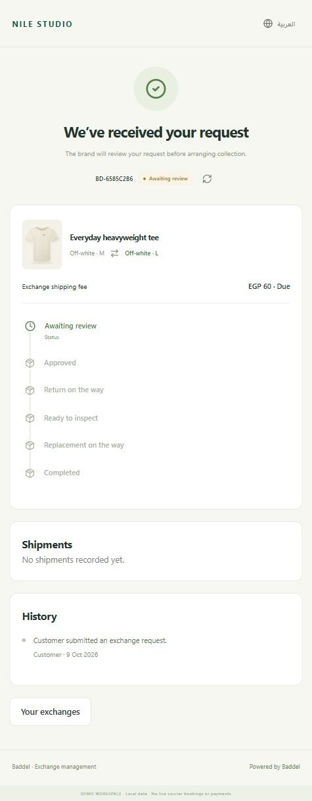
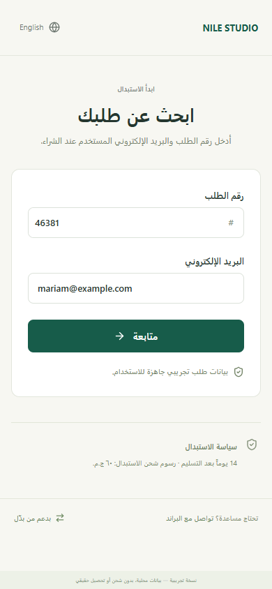
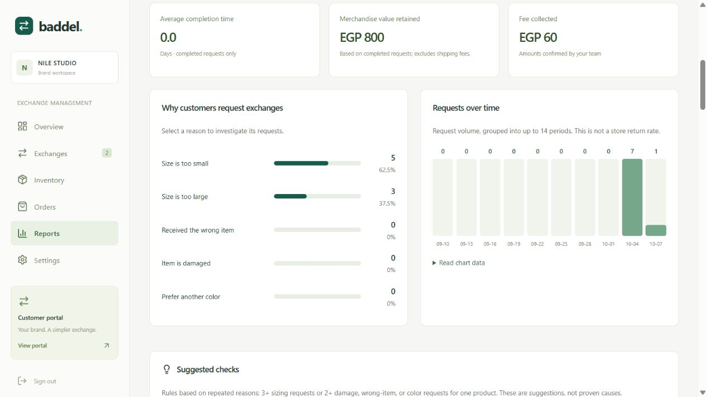

# Baddel / بدّل — exchange management for fashion brands

A working Node.js application for Egyptian fashion brands, with a customer portal and a merchant workspace. The current release supports manual order/inventory entry and manual shipment recording. **Shopify sync and automatic courier booking are not implemented in this release.**

## What does it do?

Baddel gives fashion brands one place to handle customers who need a different size or color, or received a wrong or damaged item. Customers submit and track their own exchange requests through a branded portal. The brand reviews those requests, allocates replacement stock, records the return and inspection, and manages replacement delivery.

The goal is to reduce repetitive customer-service work and make each exchange's status, evidence, stock allocation, and fees easier to follow. Fashion brands are the intended paying customers; their shoppers use the exchange portal. Subscription billing is a future feature.

بدّل يساعد براندات الملابس في مصر على إدارة طلبات الاستبدال. العميل يختار القطعة وسبب الاستبدال والمقاس أو اللون البديل ويتابع الطلب، والبراند يراجع الطلب ويدير المخزون والاستلام والفحص وإرسال البديل من لوحة واحدة. النسخة الحالية تعمل محليًا، وإدخال الطلبات وتسجيل الشحن يتمان يدويًا.

## Exchange workflow

```text
Customer verifies an order
  → selects an item, reason, evidence, and replacement
  → reviews the fee and submits a request
  → merchant approves and allocates replacement stock
  → return collection is recorded
  → returned item is received and inspected
  → replacement is dispatched
  → fee is confirmed or waived and delivery is completed
```

Customers can track progress throughout this process. Requests also support declines, cancellations before collection, and staff-recorded exception handling.

## Screenshots

The following screenshots use seeded demo data.





## Customer experience example

This example follows a shopper exchanging an off-white T-shirt from size M to size L: find the order, verify access, choose the item and reason, select a replacement, review the fee, and track the submitted request.

<p>
  
  
  
</p>

**[See all seven customer screens with explanations →](docs/CUSTOMER-EXPERIENCE.md)**

These are screenshots of the working local app with fictional demo customer details. The 60 EGP fee is a configurable example. No real email, payment, refund, or courier booking was triggered.

<details>
<summary>Arabic mobile interface</summary>



</details>

## Merchant analytics

The **Reports** page helps owners understand why customers request exchanges and decide what to investigate. The overview includes an **Analyze exchange reasons** shortcut.

- Filter by 7/30/90 days or all time, product, customer-reported reason, and request status.
- See request counts and quantities, completion time, recorded fees, and completed merchandise value retained.
- Compare request volume with the previous equal period and explore the trend chart.
- Find products driving requests and inspect original-to-replacement size/color patterns.
- Read customer comments, search matching requests, and open their evidence and actions.
- Review suggested product checks and an exception-first queue for requests without updates for 48 hours.
- Export exactly the filtered requests, with spreadsheet formula protection.



These analytics describe recorded **exchange requests**, not all store returns. Product percentages are shares of matching requests, not return rates against sales. Suggested checks use disclosed repetition thresholds and do not claim to diagnose product faults.

Read the [analytics update report](docs/ANALYTICS-UPDATE.md) for metric definitions, research, verification, and remaining improvements.

## Technology

| Layer | Implementation |
| --- | --- |
| Application | Node.js 24, TypeScript, React 19, React Router 7 with server rendering |
| Interface | Tailwind CSS 4 and custom CSS; Arabic/English with RTL support |
| Database | SQLite and Prisma with versioned migrations |
| Validation and images | Zod and Sharp; private, server-validated photo uploads |
| Notifications | Database-backed outbox and a Resend email adapter |
| Testing | Vitest backend tests and Playwright browser journeys |

SQLite and local photo storage keep the first version straightforward to run. A larger deployment will require reviewing database concurrency, shared storage, and worker operations.

## Run locally

Requires Node.js 24 and npm. Commands work in PowerShell; use `npm.cmd` if PowerShell blocks npm scripts.

```powershell
npm ci --include=dev
npm run setup
npm run db:generate
npm run db:setup
npm run dev
```

Open http://localhost:5173. Setup generates a private `.env` and creates the local database file. The database migrations are versioned. Seeding is idempotent and does not erase existing requests.

| Access                      | Details                                 |
| --------------------------- | --------------------------------------- |
| Merchant workspace          | http://localhost:5173/login             |
| Demo owner                  | `demo@baddel.local` / `DemoPass!2026`   |
| Customer portal             | http://localhost:5173/portal/nile       |
| Sample order                | `46381` / `mariam@example.com`          |
| Second tenant for isolation | `thread@baddel.local` / `DemoPass!2026` |

Demo codes appear on screen and **no email is sent in demo mode**. Shipments are recorded manually; recording a tracking number does not create a courier booking. Payment confirmation is a staff record, not a payment gateway.

For testing both roles, use two browser profiles or an incognito window. The application uses one authenticated role per browser session.

## Try the complete journey

1. Open the portal and verify the pre-filled sample order with the displayed demo code.
2. Choose a purchased item, reason, and available alternative size. Agree to the policy and submit.
3. Sign in to the merchant dashboard in a separate browser context. Open the new request.
4. Approve, record a return tracking reference, mark the return received, and pass inspection.
5. Record a replacement tracking reference and dispatch it.
6. Enter a receipt/reference and confirm the fee, or record a reason to waive it.
7. Mark the replacement delivered. Reload the customer tracking page to see completion.

The demo fee is 60 EGP, configurable under Settings. It is a sample value, not a courier quote.

## Other working features

- Create an independent brand account and portal.
- Add products, sizes, available inventory, and delivered orders.
- Verify order access before revealing customer data.
- Conditional private photo evidence; images are decoded and re-encoded server-side.
- Search/filter exchange requests and export a spreadsheet-friendly CSV.
- Decline/cancel before collection; record exceptions, resume them, or close with an alternative staff-recorded resolution.
- Inspect before restocking the original or dispatching the replacement.
- Policy/price snapshots, optimistic version checks, quantity and inventory allocation.
- English and Arabic interface, right-to-left layout, mobile navigation.
- Durable email outbox with retry state, lease recovery, expiration and idempotency keys.

## Verification commands

```powershell
npm run typecheck
npm test
npm run test:e2e
npm run build
npm run test:production
npm audit
npm run backup
```

Browser tests use installed Chrome on this Windows computer. On machines without Chrome, run `npx playwright install chromium`. Tests create uniquely named QA tenants; those are separate from the two sample brands. Unit tests use a separate `data/rules-test.db` database.

## Production build on this machine

```powershell
npm run build
npm start
```

The default demo build listens only on `127.0.0.1:3000`. Live mode requires HTTPS configuration, a strong session secret, email credentials, and a fresh database without seeded demo merchants. See [the operational guide](docs/OPERATIONS.md) before using real customer information.

## Notifications

```powershell
npm run worker
```

The worker runs separately from the web process. In demo mode it records `demo` notification outcomes. In live mode it uses Resend with `RESEND_API_KEY` and a verified `EMAIL_FROM`. The Reports page can also process the current merchant's outbox. Do not rely on that button instead of a worker for live verification emails.

## Source map

- `app/routes/`: website, customer portal/tracking, login, merchant dashboard, API and health check.
- `app/lib/exchanges.server.ts`: eligibility, submission, inventory allocation and staff workflow.
- `app/lib/security.server.ts`: password hashing, signed session cookie, tenant access, rate limits, origin checks.
- `app/lib/mail.server.ts`: durable notification delivery.
- `prisma/`: relational schema and initial migration.
- `scripts/`: setup, seeding, production launch, worker and verified backup.
- `tests/`, `e2e/`: backend and browser checks.

Read [the build report](docs/MVP-BUILD-REPORT.md) for completion status, plan changes and remaining launch work.

## Roadmap to a live merchant pilot

- Implement Shopify authentication, order/product/inventory synchronization, and supported exchange updates.
- Integrate the pilot brand's courier for pickup booking, replacement delivery, and verified status callbacks.
- Configure and verify real email delivery; add a verification option for orders without email addresses.
- Add merchant email verification, password recovery, and staff access management.
- Deploy with HTTPS, persistent private storage, supervised workers, monitoring, and tested backup recovery.
- Validate subscription pricing with pilot merchants and implement billing.

Credentials alone do not activate the unfinished Shopify or courier integrations. This version does not collect payments, issue refunds, or support exchanging into a product with a different merchandise price.

## Repository contents and private data

This repository includes application code, migrations, demo seed data, tests, screenshots, and project documentation. Local environment secrets, databases, customer uploads, backups, dependencies, and generated build/test artifacts are excluded from Git. Demo credentials above are intentionally public test fixtures; never use them for a live merchant account.
