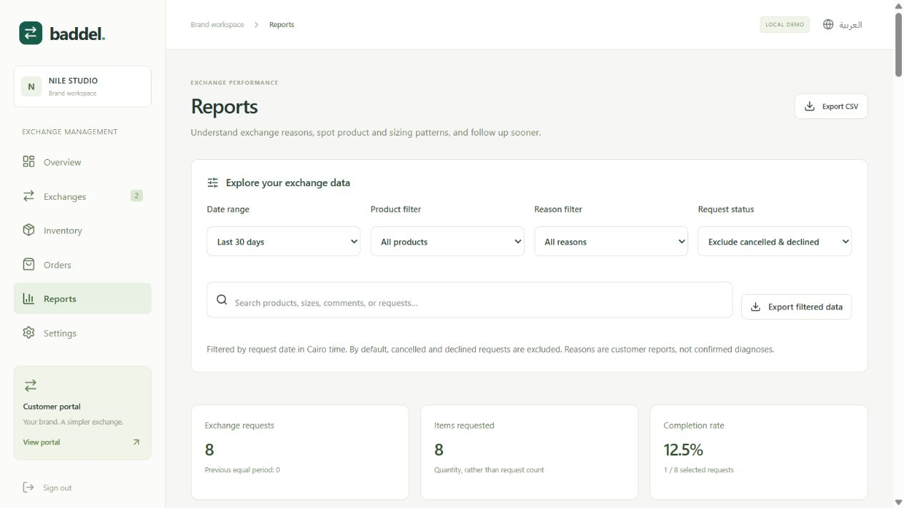

# Merchant analytics update

Date: 9 October 2026

## What changed

Baddel's Reports page now helps a brand owner investigate the reasons behind exchange requests, rather than showing only overall counts. A new overview shortcut takes the owner to the analysis page.

The update adds:

1. Date filters: last 7, 30, or 90 Cairo calendar days, including today, or all time.
2. Product, reason, and status filters, plus search across product names, sizes, request references, order numbers, customer names, and comments.
3. Six summary metrics: requests, requested units, completion rate, average completion time, merchandise value retained, and fees recorded as paid.
4. Request-volume comparisons against the previous equally long calendar period, using the same non-date filters. All-time views have no invented comparison period.
5. A reason breakdown with counts and percentage shares. Selecting a reason filters the rest of the analysis.
6. A volume trend chart with up to 14 date buckets and an accessible text listing of its data.
7. Product rankings by requested units, with request counts, shares, leading reasons, and requested merchandise values.
8. Product-specific original-to-replacement size and color combinations.
9. Suggested checks for products with repeated customer reports, with one-click product filtering.
10. A follow-up queue prioritizing explicit exceptions, then open requests without an update for at least 48 hours. Each row opens the existing request detail and actions.
11. Searchable customer comments and matching requests, also linked to request details.
12. A filtered CSV export, including quantities, original/replacement variants, comments, fees, and dates. Text is quoted and protected against common spreadsheet formula prefixes.
13. Arabic translations, RTL layout, and responsive controls and charts. Filter choices remain in the page URL across refreshes.
14. Expanded search in the main Exchanges list, including comments, product snapshot details, and reason labels.

No new paid services, third-party dependencies, database migrations, or external customer messages were introduced.

## Screenshots

All screenshots use the existing fictional Nile Studio demo brand and sample exchange data.

[Full Reports page screenshot](screenshots/merchant-analytics-full.jpg)

## Reading the numbers correctly

| Metric | Definition |
| --- | --- |
| Exchange requests | Matching requests submitted in the selected Cairo calendar window. Cancelled and declined requests are excluded by default; the owner can include them. |
| Items requested | Sum of the matching requests' quantities. One two-item request contributes one request and two units. |
| Reason share | Requests with that reason divided by all matching requests. These are customer-reported explanations, not verified diagnoses. |
| Product share | Matching requests for the product divided by all matching requests. Products are grouped by stable product ID, even when names change. |
| Completion rate | Currently completed matching requests divided by all matching requests. Recent requests may still be in progress. |
| Average completion time | Elapsed time from submission to completion for matching completed requests with valid timestamps. No completions display a dash. |
| Merchandise value retained | Original paid merchandise snapshot price multiplied by quantity for completed matching requests. Shipping is excluded; this is not incremental profit. |
| Requested merchandise value | Original paid merchandise snapshot price multiplied by quantity for all matching requests. This is not a refund amount or a confirmed loss. |
| Fee collected | Fees on matching requests marked paid by staff. This is a recorded payment confirmation, not a payment-gateway settlement. |
| Follow-up age | Elapsed time since the request's last saved update. The queue is scoped to the selected filters; use all time to inspect older requests. |

Charts and rankings summarize exchange activity. The app does not yet have a complete synchronized sales denominator, so it does **not** advertise a store-wide or product return rate. It also does not count refunds, product faults that were never reported, or courier costs that are not recorded.

The dashboard shows the top 20 products, size/color combinations, and latest matching requests; suggested checks show the top six and the queue the first ten. Summary metrics and CSV exports include all matches, not just displayed rows.

## How suggested checks work

These are transparent local rules, not an AI diagnosis or statistical outlier detector:

- Three or more sizing reports for one product suggest checking its size chart, garment measurements, and requested size changes.
- Two or more damage reports suggest examining packaging, batches, photos, and customer comments.
- Two or more wrong-item reports suggest reviewing packing checks and variant labels.
- Two or more color reports suggest reviewing product photos and descriptions while allowing for customer preference.

Evidence is never combined across unrelated products. Each suggestion shows the number of matching reports and total selected requests for that product. Low-volume or empty selections show clear empty states.

## Research that informed the choices

Loop's official [Return Insights documentation](https://help.loopreturns.com/en/articles/13680897) describes product-level investigation, return reasons alongside product rankings, and product lookup. Its guide distinguishes product-level insights from variant-level detail. We adopted product drill-down and size/color breakdowns; we did not copy its statistical outlier claims without the required sales data.

AfterShip's official [Return Analytics guide](https://support.aftership.com/en/returns/articles/15390499-learn-more-about-return-analytics) describes date/status filters, product and reason analysis, operational reporting, exports, and rates based on sales denominators. This informed the filters, trend and product views, and the distinction between request shares and return rates.

The follow-up queue and comment search are additional choices tailored to the MVP's manual merchant workflow.

## Verification

- 42 backend checks passed, including nine new analytics checks for date boundaries, previous periods, multi-unit requests, merchandise snapshots, filters, product identity, queue priorities, suggestion thresholds, empty data, and CSV formula protection.
- All 11 browser journeys passed: the original seven MVP journeys and four new analytics journeys covering metrics, drill-down, refresh persistence, filtered download, empty/reset states, Arabic mobile layout, and tenant separation.
- Type checking, formatting, the production build, and production smoke verification passed.
- Desktop and Arabic mobile screenshots were inspected. No real emails, courier bookings, payments, or refunds were sent for this update.

The existing browser test for retained value was made specific to that metric card because the new product table can legitimately display the same monetary value.

## Useful next improvements

1. Synchronize complete delivered-order and sales data before adding true product/variant exchange rates. Define cohort dates and deduplicate repeated requests for the same purchased units.
2. Add optional structured fit details, such as length, waist, or shoulders, to complement the current reason and free-text comment.
3. Add merchant-configurable follow-up thresholds and team assignment after staff roles are implemented.
4. Record actual courier and handling costs before showing net cost or profit estimates.
5. Move aggregation, filtering, and pagination to the server before large-volume deployment. The current MVP calculates analytics from its tenant-scoped dashboard dataset in the browser.

[Back to the overview](../README.md)
