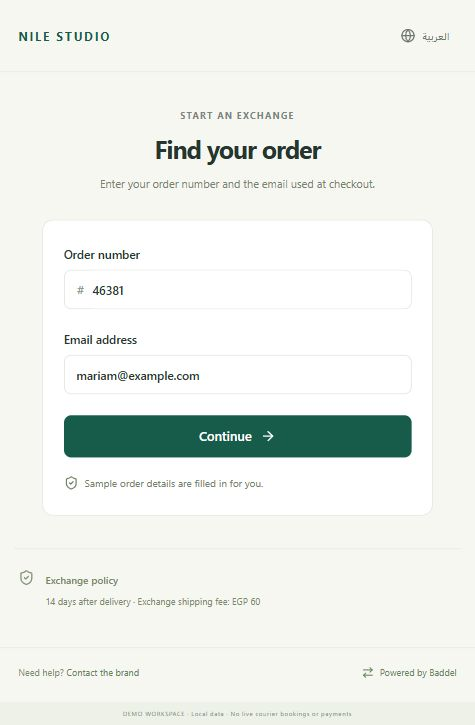
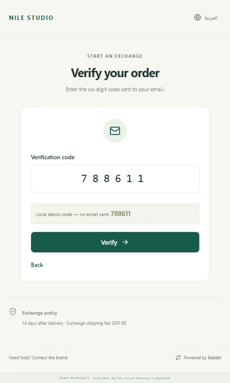
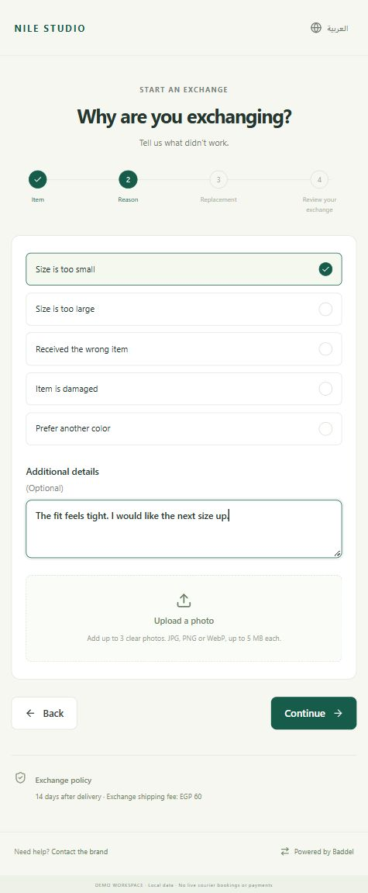
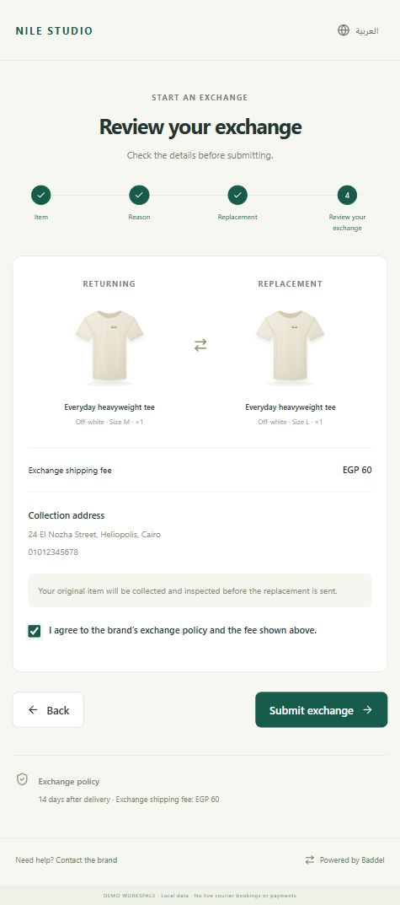

# Customer experience example

This walkthrough shows a customer exchanging an off-white Everyday heavyweight tee from size M to size L through the Nile Studio demo brand. Every screenshot comes from the working Baddel app, using fictional demo customer data.

The screenshots show the current mobile-friendly layout. The app also supports desktop and Arabic with a right-to-left layout.

## 1. Find the order

The customer enters the order number and the email used at checkout. The brand's exchange window and shipping fee are visible before starting.

## 2. Verify access

The customer verifies the order using a six-digit code before seeing its items. In this local demo, the code appears on screen and no email is sent. Live email delivery requires configuration and verification.

## 3. Choose the purchased item

The customer sees the order's items, original sizes, and prices, then selects the T-shirt to exchange. The progress indicator explains the remaining steps.

## 4. Explain the reason

The customer selects “Size is too small” and adds an optional note. Photos can be attached here; wrong-item or damage requests can require evidence under the brand's policy.

## 5. Choose the replacement

The customer chooses size L. The current size and sold-out sizes are disabled. Replacement stock is allocated when the merchant approves the request.

## 6. Review and submit

The customer checks the original and replacement items, quantity, collection address, and exchange fee, then agrees to the displayed policy. This example uses an inspection-first process: the original item is inspected before the replacement is sent.

The 60 EGP fee is a configurable demo amount, not a courier quote. Submitting the request does not collect this fee.

## 7. Track the request

After submission, the customer receives a request reference and sees “Awaiting review.” The timeline shows the stages ahead, while the shipment and history sections show records as the merchant updates the request.

This screenshot shows a newly submitted request; it does not claim collection or delivery has already happened. Courier tracking references are entered manually in the current MVP.

## Arabic support

Customers can switch languages. This additional demo screenshot shows the Arabic portal.

No real customer information, emails, payments, refunds, or courier bookings were used for this walkthrough. Shopify synchronization and automatic courier booking remain future integrations.

[Back to the project overview](../README.md)
